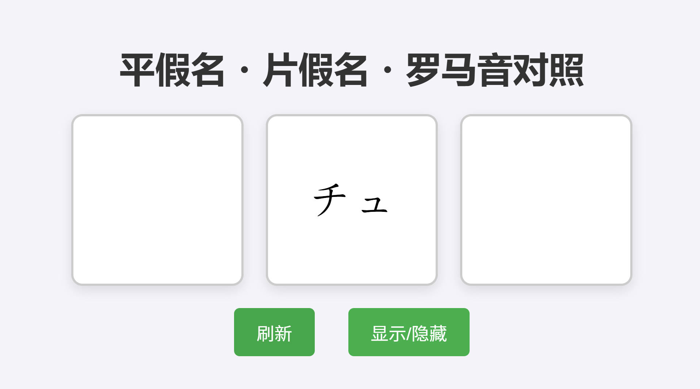

# 平假名・片假名・罗马音学习工具

这是一个简单的网页应用，帮助用户学习平假名、片假名和罗马音的对应关系。页面上有三个方格，分别显示平假名、片假名和罗马音中的一个，用户可以通过按钮来刷新或切换显示/隐藏其他两个方格的内容。

## 功能

- **刷新**: 每次点击“刷新”按钮，随机选择一个假名（平假名、片假名或罗马音）并显示在随机的一个方格中，其他两个方格保持空白。
- **显示/隐藏**: 点击“显示/隐藏”按钮可以显示或隐藏当前未显示的两个方格内容。再次点击可以切换回隐藏状态。
  
## 安装与运行

1. 克隆或下载项目代码。
2. 打开项目目录中的 `index.html` 文件，即可在浏览器中运行该应用。

## 使用说明

1. **刷新按钮**: 点击“刷新”按钮后，页面将随机选择一个假名，并在随机的方格中显示。每次刷新只显示一个假名，其余两个方格为空白。
2. **显示/隐藏按钮**: 点击“显示/隐藏”按钮，显示当前未显示的两个方格的内容。如果已显示，再次点击会将内容隐藏。
